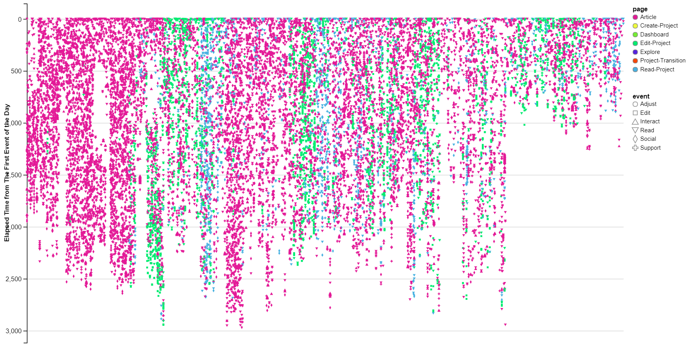

## Paul (Yang) Xu's Code Portfolio

This repository documents some of my work doing different types of machine learning, statistical data analysis, and data visualization tasks. In this repository, you will find:

#### Non-MNIST Digit Regocnition

This is a most recent machine learning practice using the [Character Font Images dataset](https://archive.ics.uci.edu/ml/datasets/Character+Font+Images) from the [UCI Machine Learning repository](https://archive.ics.uci.edu/ml/index.php) with the Python stack (`numpy`, `pandas`, `scikit-learn`, `matplotlib`, `xgboost`, `tensorflow`)

#### Dynamic Social Network Analysis

I built a temporal social network with R, Tableau, and [Gephi](https://archive.ics.uci.edu/ml/datasets/Character+Font+Images) with student and teacher behavioral data from an online reading platform called [Udio](http://cet.cast.org/research-overview/udio-literacy-intervention/). To see a video of the visualization of that network, please click [this link](https://www.youtube.com/watch?v=FnpdwZ_oJnE).

In this folder, you will find:

- R Script with which I cleaned the data
- The network file (Gephi)
- Papers written and conference posters

#### "Confetti Chart" Analysis

Using the same data from [Udio](http://cet.cast.org/research-overview/udio-literacy-intervention/), I used Process Mining techniques ([Dotted Chart Analysis](https://www.futurelearn.com/courses/process-mining/0/steps/15627)) to visualize in a given class, what the students did in the learning environment collectively throughout a semester. Because the chart looks like confetti dropping, I named it confetti chart analysis. To see a live Shiny dashboard based on `ggvis`, please [click here](https://paulxu.shinyapps.io/udio/). The folder contains the R code used to build the dashboard.

#### Statistical Data Analysis

This folder contains R code that I used for an actual research project, where I used various R packages to clean data before performing descriptive and inferential statistical analysis.

#### A List of MOOCs Completed

Total: 64 Courses.  Certificates: Specialization: 4, Individual: 29

*: course completed with verified certificate

###### Mathematics & Statistics:

- Single Variable Calculus (Penn) (5 Courses)
- Introduction to Probability: The Science of Uncertainty (MITx)
- *Computational Probability and Inference (MITx)
- Applied Logistic Regression (OSU)

###### CS Fundamentals

- Introduction to Python (Microsoft)
- *Introduction to Computer Science and Programming Using Python (MITx)
- Computational Thinking and Data Science with Python (MITx)
- Software Construction in Java (MITx)
- *Advanced Software Construction in Java (MITx)
- Introduction to Linux (The Linux Foundation)
- Fundamentals of Red Hat Enterprise Linux (Red Hat)

###### Programming Languages

- *Programming Languages: Part A (UW)
- *Programming Languages: Part B (UW)
- *Programming Languages: Part C (UW)
- Introduction to Functional Programming with Haskell (Glasgow)
- *Functional Programming in Scala (EPFL)
- *Functional Program Design (EPFL)
- *Parallel Programming (EPFL)
- *Big Data and Spark (EPFL)
- *Functional Programming with Scala Capstone (EPFL)
- Paradigms of Computer Programming: the Fundamentals (Louvain)
- Paradigms of Computer Programming: Concurrency (Louvain)

###### Machine Learning

-*Statistical Learning (Stanford)
-*Machine Learning (Stanford)
-*Machine Learning: Foundations (UW)
-*Machine Learning: Regression (UW)
-*Machine Learning: Classification (UW)
-*Machine Learning: Clustering and Retrieval (UW)
-*Learning From Data: Introductory Machine Learning Course (CalTech)
-Principles of Machine Learning (Microsoft)
-Applied Machine Learning (Microsoft)  TO BE FINISHED
-Practical Predictive Analysis (UW)
-*Neural Networks and Deep Learning (deeplearning.ai)
-*Improving Deep Neural Networks: Hyperparameter tuning, Regularization and Optimization -(deeplearning.ai)
-*Structuring Machine Learning Projects (deeplearning.ai)
-*Convolutional Neural Networks (deeplearning.ai)
-*Sequence Models (deeplearning.ai)

###### Data Science

- *Introduction to Apache Spark (Berkeley)
- *Big Data Analysis with Apache Spark (Berkeley)
- *Distributed Machine Learning with Apache Spark (Berkeley)
- Processing Big Data with Hadoop Azure HDInsight (Microsoft)
- Implementing Predictive Analytis with Spark in Azure HDInsight (Microsoft)
- Implementing Real-Time Analytics with Hadoop in Azure HDInsight (Microsoft)

###### Cloud Technologies

- Introduction to Cloud Infrastructure and Technologies (Linux Foundation)
- Big Data for Smart Cities (IEEE)
- Introduction to Microsoft Azure (Microsoft)
- Introduction to Kubernetes (LF158 Linux Foundation) 
- *Introduction to Kubernetes (LF258 Linux Foundation)
- Introduction to DevOps (Linux Foundation)
- Introduction to OpenStack (Linux Foundation)
- Introduction to CloudFoundry and Cloud Native Software Architecture
- Fundamentals of Containers, Kubernetes, and Open Shift (RedHatX)
- Apache Spark on AWS TO BE FINISHED

###### Entrepreneurship

- *User Innovation: A Path to Entrepreneurship (MITx)
- *Entrepreneurship 101: Who are your clients? (MITx)

###### Other:

- *The Internet of Things course with MIT Professional Education (MITx)
- Practical Learning Analytics  (Michigan)
- MongoDB 101: MongoDB with Python (Mongo University)
- MongoDB and Apache Spark (Mongo University)
- *Research Data Management and Sharing (Edinburgh)
- Learning How to Learn  (UC San Diego)